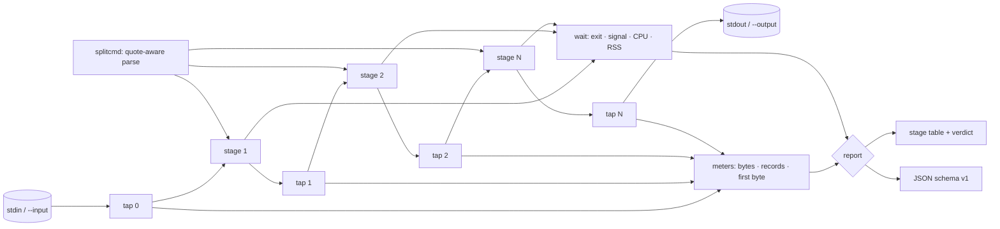

# pipeprof

[English](README.md) | [中文](README.zh.md) | [日本語](README.ja.md)

[](LICENSE) [](go.mod) [](CHANGELOG.md)  [](CONTRIBUTING.md)

**pipeprof：改変していないシェルパイプラインの全ステージを一度の実行でプロファイルする、オープンソースかつ依存ゼロの CLI —— ステージごとのバイト数・レコード数・実時間・CPU 時間・終了コードに加え、ボトルネックを名指しする判定付き。**


```bash
git clone https://github.com/JaydenCJ/pipeprof && cd pipeprof
go build -o pipeprof ./cmd/pipeprof    # single static binary, stdlib only
```

> プレリリース：v0.1.0 はまだどのパッケージレジストリにも公開されていません。上記の手順でソースからビルドしてください（Go ≥1.22、Linux/macOS）。

## なぜ pipeprof？

データエンジニアはどのステージが遅いかを勘で当てている。パイプは流れ、`top` がちらつき、誰かが雰囲気で「sort が犯人だ」と断言する。既存ツールでは決着がつかない。`pv` は一点しか測れず —— 二つのステージの間に差し込み、再実行し、位置を変えてまた再実行 —— しかも CPU 時間や終了コードは何も知らない。`time` はパイプ全体を包んで合計値を三つ返すだけ。`hyperfine` はコマンド全体を変種と比較するだけで、パイプの中を一切覗かない。pipeprof は中を覗く。普段実行しているパイプラインをそのまま引用符で渡すだけで、pipeprof はシェルと同一のプロセス群を起動し、全境界に計数タップを差し込み、一枚の表を出力する：各境界を通過したバイトとレコード、ステージごとの実時間と CPU 時間、最初の出力時刻（ブロックする `sort` の典型的な兆候）、SIGPIPE 死を名指しするステージ別終了コード、そして CPU 占有率に裏付けられたボトルネック判定 —— 一度の実行で。一点計測器には構造的に決して見えない全体像だ。

| | pipeprof | pv | time | hyperfine |
|---|---|---|---|---|
| 一度の実行で全ステージを計測 | ✅ | ❌ 挿入点は一つ | ❌ パイプ全体のみ | ❌ コマンド全体のみ |
| パイプラインは無改変 | ✅ そのまま引用 | ❌ パイプへの挿入が必要 | ✅ | ✅ |
| 境界ごとのバイト + レコード数 | ✅ | 挿入点のバイトのみ | ❌ | ❌ |
| ステージ別 CPU 時間・RSS・終了コード | ✅ | ❌ | ❌ 合計のみ | ❌ 合計のみ |
| ステージ別の最初の出力時刻 | ✅ | ❌ | ❌ | ❌ |
| ボトルネック判定 | ✅ | ❌ | ❌ | 変種間の比較のみ |
| 機械可読な JSON レポート | ✅ | ❌ | ❌ | ✅ |
| ランタイム依存 | 0 | libc | シェル組み込み | Rust バイナリ |

<sub>2026-07-12 確認：pv 1.8 のドキュメントは呼び出しごとに計測点が一つであると明記。bash の `time` キーワードはパイプ全体の real/user/sys のみ報告。hyperfine は複数回実行でコマンド全体を比較する。pipeprof は Go 標準ライブラリのみを import する。</sub>

## 特徴

- **一度の実行でパイプ全体を可視化** —— 全境界に計数タップ。15.8MiB がどこで 485KiB になり、33,333 レコードがどこで 997 に潰れるかが表で一目瞭然。
- **パイプラインは無改変** —— 普段の実行内容をそのまま渡す。引用符を理解する分割が `'a|b'`、`$(x | y)`、バッククォートを保護し、本物のシェルが必要な記法は `--shell` を案内して拒否 —— 黙って誤実行しない。
- **スループットだけでなく遅延の兆候も** —— ステージ別の最初の出力時刻がブロックするステージを暴く。進行 93% でようやく出力を始める `sort` は、CPU 占有率が控えめでも遅延の真犯人だ。
- **シェルに忠実な意味論** —— 透過出力はバイト単位で一致、下流の早期終了時は上流へ SIGPIPE を伝播（`yes | head -3` は `SIGPIPE` を正直に報告）、終了コードは最終ステージまたは `--pipefail`、起動不能なステージは 127 と注記で優雅に縮退。
- **正直な判定** —— ボトルネック行は CPU 占有率が最大のステージを名指しし、その最初の出力の進行率を添える。計測可能な CPU を使ったステージが無ければ、でっち上げずに無いと言う。
- **スクリプトから扱いやすい** —— ステージ別スループット入りの安定 JSON（`schema_version` 1）。レポートは既定で stderr（または `--report FILE`）に出るため、pipeprof 自身がより大きなパイプの中に収まれる。
- **依存ゼロ・完全オフライン** —— Go 標準ライブラリのみ。対話する相手はあなたが実行を頼んだプロセスだけ。テレメトリなし、ネットワーク通信は一切なし。

## クイックスタート

```bash
# fabricate a deterministic 200k-line access log, then: which stage is slow?
bash examples/make-demo-log.sh /tmp/demo.log
./pipeprof --input /tmp/demo.log --no-output 'grep " 500 " | cut -d" " -f7 | sort | uniq -c | sort -rn'
```

実際にキャプチャした出力：

```text
pipeprof — 5 stages, 50ms total, exit 0

#  COMMAND        IN BYTES  OUT BYTES  RECORDS  WALL    CPU  FIRST OUT  EXIT
1  grep " 500 "    15.8MiB     2.6MiB   33,333  44ms   27ms      3.4ms     0
2  cut -d" " -f7    2.6MiB     485KiB   33,333  43ms   10ms      4.0ms     0
3  sort             485KiB     485KiB   33,333  49ms  8.4ms       47ms     0
4  uniq -c          485KiB    22.3KiB      997  47ms  2.9ms       48ms     0
5  sort -rn        22.3KiB    22.3KiB      997  47ms  2.2ms       50ms     0

bottleneck: stage 1 (grep " 500 ") — 53.7% of pipeline CPU, first output after 7% of the run
```

失敗時の意味論もシェルに忠実（`pipeprof --no-output 'yes | head -3'`、実出力）：

```text
pipeprof — 2 stages, 3.6ms total, exit 0

#  COMMAND  IN BYTES  OUT BYTES  RECORDS   WALL    CPU  FIRST OUT     EXIT
1  yes             —    64.0KiB   32,768  3.6ms  1.5ms      2.3ms  SIGPIPE
2  head -3   64.0KiB         6B        3  1.6ms  1.4ms      3.4ms        0

bottleneck: stage 1 (yes) — 52.3% of pipeline CPU, first output after 64% of the run
```

## 表の読み方

ステージ *i* の `IN` と直前ステージの `OUT` は同一の境界タップなので、表の数字は必ず整合する。計測手法の全容は [docs/how-it-works.md](docs/how-it-works.md) を参照。

| 列 | 意味 |
|---|---|
| `IN BYTES` / `OUT BYTES` | 境界を通ってステージに入った / 出たバイト数（`—` = stdin 未接続） |
| `RECORDS` | ステージが出力したレコード数。既定は改行区切り、`find -print0` ストリームには `--records nul`、`--records none` では `—` |
| `WALL` | そのプロセスの Start→Wait の時間。ステージは並行して重なるため、列の合計は全体と一致しない |
| `CPU` | getrusage による user+sys 時間 —— 最も正直なボトルネック信号 |
| `FIRST OUT` | パイプライン開始 → そのステージの最初の出力バイト。`—` = 出力なし |
| `EXIT` | 終了コード。シグナル死の場合はシグナル名（`SIGPIPE`） |

## CLI リファレンス

`pipeprof [flags] 'stage1 | stage2 | …'` —— レポートは stderr へ、パイプライン自身の stdout は無加工で透過。終了コード：パイプライン自身のコード（最終ステージ、`--pipefail` 時は最右の失敗ステージ）、2 = 使い方エラー、124 = タイムアウト、125 = 内部エラー。

| フラグ | 既定値 | 効果 |
|---|---|---|
| `--json` | オフ | レポートを JSON で出力（`schema_version` 1） |
| `--report FILE` | stderr | レポートをファイルへ書き出す |
| `--input FILE` | stdin | 最初のステージへファイルを供給（端末は決して接続しない） |
| `--output FILE` | stdout | 最終ステージの出力をファイルへ |
| `--no-output` | オフ | 最終ステージの出力を破棄（プロファイルのみ） |
| `--records` | `lines` | レコード計数方式：`lines`・`nul`・`none` |
| `--shell` | オフ | 各ステージを `sh -c` 経由で実行（グロブ・環境変数・リダイレクト） |
| `--pipefail` | オフ | 最右の失敗ステージの終了コードで終了 |
| `--timeout DUR` | オフ | DUR 経過後にパイプライン全体を停止。終了コード 124 |
| `--wide` | オフ | 表内のコマンドを決して切り詰めない |

## 検証

このリポジトリは CI を同梱しません。上記の主張はすべてローカル実行で検証されます：

```bash
go test ./...            # 90 deterministic tests, offline, < 1 s
bash scripts/smoke.sh    # end-to-end CLI check, prints SMOKE OK
```

## アーキテクチャ



## ロードマップ

- [x] v0.1.0 —— 引用符対応の解析、境界ごとのバイト/レコードタップ、ステージ別の実時間/CPU/RSS/初出力/終了コード計測、SIGPIPE に忠実な配管、表 + JSON レポート、ボトルネック判定、90 テスト + smoke スクリプト
- [ ] ライブモード：パイプライン実行中に表を更新（長時間の ETL ジョブ向け）
- [ ] ストール検出：パイプバッファの背圧をサンプリングし「遅い生産者」と「遅い消費者」を判別
- [ ] `--compare 'variant'` —— 二つのパイプラインを一枚のレポートで A/B 比較
- [ ] CSV エクスポートと `--baseline` 差分によるスクリプトでの回帰追跡
- [ ] テキスト表にステージ別ピーク RSS 列を追加（JSON には実装済み）

全リストは [open issues](https://github.com/JaydenCJ/pipeprof/issues) を参照。

## コントリビュート

Issue・議論・PR を歓迎します —— ローカルの作業手順（フォーマット、vet、テスト、`SMOKE OK`）は [CONTRIBUTING.md](CONTRIBUTING.md) を参照してください。入門向けタスクは [good first issue](https://github.com/JaydenCJ/pipeprof/issues?q=is%3Aissue+is%3Aopen+label%3A%22good+first+issue%22) のラベル付き、設計の議論は [Discussions](https://github.com/JaydenCJ/pipeprof/discussions) へ。

## ライセンス

[MIT](LICENSE)
