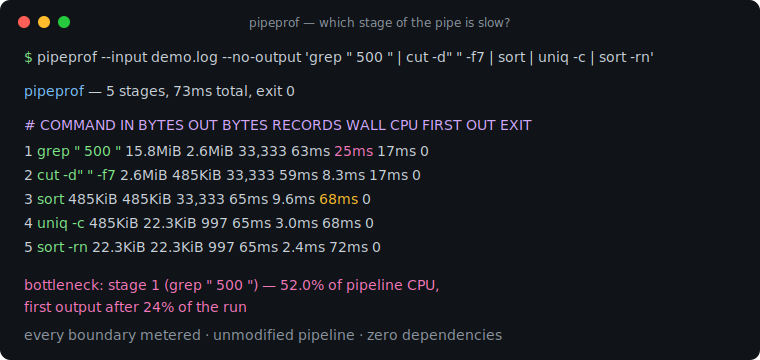
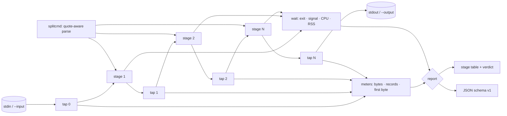

# pipeprof

[English](README.md) | [中文](README.zh.md) | [日本語](README.ja.md)

[](LICENSE) [](go.mod) [](CHANGELOG.md)  [](CONTRIBUTING.md)

**pipeprof：an open-source, zero-dependency CLI that profiles every stage of an unmodified shell pipeline at once — bytes, records, wall time, CPU time and exit code per stage, plus a verdict naming the bottleneck.**



```bash
git clone https://github.com/JaydenCJ/pipeprof && cd pipeprof
go build -o pipeprof ./cmd/pipeprof    # single static binary, stdlib only
```

> Pre-release: v0.1.0 is not tagged on a package registry yet; build from source as above (any Go ≥1.22, Linux/macOS).

## Why pipeprof?

Data engineers guess which pipeline stage is slow. The pipe runs, `top` flickers, and someone declares "it's the sort" on vibes. The existing tools can't settle it: `pv` measures one point — you splice it between two stages, rerun, move it, rerun again — and it still knows nothing about CPU time or exit codes; `time` wraps the whole pipeline and returns three aggregate numbers; `hyperfine` benchmarks the whole command against variants without ever looking inside it. pipeprof looks inside. You quote the pipeline exactly as you already run it, unmodified; pipeprof launches the same processes your shell would, splices a counting tap onto every boundary, and prints one table: bytes and records crossing each boundary, wall and CPU time per stage, time to first output (the signature of a blocking `sort`), per-stage exit codes with SIGPIPE deaths named, and a bottleneck verdict backed by CPU share — from a single run, structurally beyond what a one-point meter can ever see.

| | pipeprof | pv | time | hyperfine |
|---|---|---|---|---|
| Profiles every stage in one run | ✅ | ❌ one splice point | ❌ whole pipe only | ❌ whole command only |
| Pipeline runs unmodified | ✅ quoted as-is | ❌ inserted into the pipe | ✅ | ✅ |
| Bytes + records per boundary | ✅ | bytes at its point | ❌ | ❌ |
| Per-stage CPU time, RSS, exit code | ✅ | ❌ | ❌ aggregate | ❌ aggregate |
| Time to first output per stage | ✅ | ❌ | ❌ | ❌ |
| Bottleneck verdict | ✅ | ❌ | ❌ | across variants only |
| Machine-readable JSON report | ✅ | ❌ | ❌ | ✅ |
| Runtime dependencies | 0 | libc | shell built-in | Rust binary |

<sub>Checked 2026-07-12: pv 1.8 documents a single measurement point per invocation; bash's `time` keyword reports real/user/sys for the pipeline as a whole; hyperfine compares whole commands across runs. pipeprof imports the Go standard library only.</sub>

## Features

- **Whole-pipe visibility in one run** — every boundary gets a counting tap; the table shows where 15.8MiB becomes 485KiB and where 33,333 records collapse to 997.
- **Unmodified pipelines** — quote what you already run. Quote-aware splitting keeps `'a|b'`, `$(x | y)` and backticks intact; anything needing a real shell is rejected with a pointer at `--shell`, never silently misrun.
- **Latency signatures, not just throughput** — per-stage time to first output exposes blocking stages: a `sort` that emits at 93% of the run is your latency culprit even when its CPU share looks modest.
- **Shell-faithful semantics** — byte-identical passthrough output, SIGPIPE propagation on early exit (`yes | head -3` reports `SIGPIPE`), last-stage or `--pipefail` exit codes, graceful 127 + note when a stage can't start.
- **Honest verdicts** — the bottleneck line names the stage with the largest CPU share and its first-output percentage; when nothing used measurable CPU it says so instead of inventing one.
- **Scriptable** — stable JSON (`schema_version` 1) with per-stage throughput; report on stderr (or `--report FILE`) so pipeprof itself can sit inside a larger pipe.
- **Zero dependencies, fully offline** — Go standard library only; the only processes it talks to are the ones you asked it to run. No telemetry, no network, ever.

## Quickstart

```bash
# fabricate a deterministic 200k-line access log, then: which stage is slow?
bash examples/make-demo-log.sh /tmp/demo.log
./pipeprof --input /tmp/demo.log --no-output 'grep " 500 " | cut -d" " -f7 | sort | uniq -c | sort -rn'
```

Real captured output:

```text
pipeprof — 5 stages, 50ms total, exit 0

#  COMMAND        IN BYTES  OUT BYTES  RECORDS  WALL    CPU  FIRST OUT  EXIT
1  grep " 500 "    15.8MiB     2.6MiB   33,333  44ms   27ms      3.4ms     0
2  cut -d" " -f7    2.6MiB     485KiB   33,333  43ms   10ms      4.0ms     0
3  sort             485KiB     485KiB   33,333  49ms  8.4ms       47ms     0
4  uniq -c          485KiB    22.3KiB      997  47ms  2.9ms       48ms     0
5  sort -rn        22.3KiB    22.3KiB      997  47ms  2.2ms       50ms     0

bottleneck: stage 1 (grep " 500 ") — 53.7% of pipeline CPU, first output after 7% of the run
```

Failure semantics stay shell-faithful (`pipeprof --no-output 'yes | head -3'`, real output):

```text
pipeprof — 2 stages, 3.6ms total, exit 0

#  COMMAND  IN BYTES  OUT BYTES  RECORDS   WALL    CPU  FIRST OUT     EXIT
1  yes             —    64.0KiB   32,768  3.6ms  1.5ms      2.3ms  SIGPIPE
2  head -3   64.0KiB         6B        3  1.6ms  1.4ms      3.4ms        0

bottleneck: stage 1 (yes) — 52.3% of pipeline CPU, first output after 64% of the run
```

## Reading the table

Stage *i*'s `IN` and the previous stage's `OUT` are the same boundary tap, so the table always adds up. Full methodology in [docs/how-it-works.md](docs/how-it-works.md).

| Column | Meaning |
|---|---|
| `IN BYTES` / `OUT BYTES` | bytes that crossed the boundary into / out of the stage (`—` = no stdin wired) |
| `RECORDS` | records out of the stage; newline-delimited by default, `--records nul` for `find -print0` streams, `—` with `--records none` |
| `WALL` | Start→Wait for that process; stages overlap, so columns don't sum to the total |
| `CPU` | user+sys time from getrusage — the honest bottleneck signal |
| `FIRST OUT` | pipeline start → the stage's first output byte; `—` = never produced output |
| `EXIT` | exit code, or the signal name (`SIGPIPE`) for signal deaths |

## CLI reference

`pipeprof [flags] 'stage1 | stage2 | …'` — the report goes to stderr; the pipeline's stdout passes through untouched. Exit codes: the pipeline's own code (last stage, or rightmost failure with `--pipefail`); 2 usage error; 124 timeout; 125 internal error.

| Flag | Default | Effect |
|---|---|---|
| `--json` | off | emit the report as JSON (`schema_version` 1) |
| `--report FILE` | stderr | write the report to a file instead |
| `--input FILE` | stdin | feed a file to the first stage (a terminal is never wired) |
| `--output FILE` | stdout | write final-stage output to a file |
| `--no-output` | off | discard final-stage output (profile only) |
| `--records` | `lines` | record counting: `lines`, `nul`, `none` |
| `--shell` | off | run each stage via `sh -c` (globs, env vars, redirects) |
| `--pipefail` | off | exit with the rightmost failing stage |
| `--timeout DUR` | off | kill the pipeline after DUR; exit 124 |
| `--wide` | off | never truncate commands in the table |

## Verification

This repository ships no CI; every claim above is verified by local runs:

```bash
go test ./...            # 90 deterministic tests, offline, < 1 s
bash scripts/smoke.sh    # end-to-end CLI check, prints SMOKE OK
```

## Architecture



## Roadmap

- [x] v0.1.0 — quote-aware parsing, per-boundary byte/record taps, per-stage wall/CPU/RSS/first-output/exit measurement, SIGPIPE-faithful plumbing, table + JSON reports, bottleneck verdict, 90 tests + smoke script
- [ ] Live mode: refresh the table while the pipeline runs (long ETL jobs)
- [ ] Stall detection: sample pipe-buffer backpressure to tell "slow producer" from "slow consumer"
- [ ] `--compare 'variant'` — A/B two pipelines in one report
- [ ] CSV export and a `--baseline` diff for regression tracking in scripts
- [ ] Per-stage peak-RSS column in the text table (already in JSON)

See the [open issues](https://github.com/JaydenCJ/pipeprof/issues) for the full list.

## Contributing

Issues, discussions and pull requests are welcome — see [CONTRIBUTING.md](CONTRIBUTING.md) for the local workflow (format, vet, tests, `SMOKE OK`). Good entry points are labelled [good first issue](https://github.com/JaydenCJ/pipeprof/issues?q=is%3Aissue+is%3Aopen+label%3A%22good+first+issue%22), and design questions live in [Discussions](https://github.com/JaydenCJ/pipeprof/discussions).

## License

[MIT](LICENSE)
