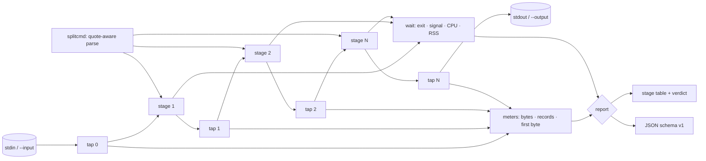

# pipeprof

[English](README.md) | [中文](README.zh.md) | [日本語](README.ja.md)

[](LICENSE) [](go.mod) [](CHANGELOG.md)  [](CONTRIBUTING.md)

**pipeprof：开源、零依赖的 CLI，一次运行即可剖析未经改动的 shell 管道的每一级 —— 每级的字节数、记录数、墙钟时间、CPU 时间与退出码，并给出点名瓶颈的结论。**


```bash
git clone https://github.com/JaydenCJ/pipeprof && cd pipeprof
go build -o pipeprof ./cmd/pipeprof    # single static binary, stdlib only
```

> 预发布提示：v0.1.0 尚未发布到任何包仓库；请按上述方式从源码构建（任意 Go ≥1.22，Linux/macOS）。

## 为什么选 pipeprof？

数据工程师全靠猜哪一级管道慢。管道跑着，`top` 闪着，有人凭感觉断言"是 sort 的锅"。现有工具给不出定论：`pv` 只测一个点 —— 你把它插到两级之间，重跑，挪个位置，再重跑 —— 而且它对 CPU 时间和退出码一无所知；`time` 包住整条管道，只吐出三个总量数字；`hyperfine` 拿整条命令和变体互相比拼，却从不看管道内部。pipeprof 看内部。你把管道原样加引号传入，不做任何改动；pipeprof 启动与 shell 完全相同的进程，在每个边界接上计数探头，打印一张表：每个边界穿过的字节与记录、每级的墙钟与 CPU 时间、首字节输出时刻（阻塞型 `sort` 的典型特征）、逐级退出码并点名 SIGPIPE 死亡，以及以 CPU 占比为依据的瓶颈结论 —— 一次运行即得，这是单点计量器在结构上永远看不到的全貌。

| | pipeprof | pv | time | hyperfine |
|---|---|---|---|---|
| 一次运行剖析每一级 | ✅ | ❌ 只有一个插入点 | ❌ 只看整条管道 | ❌ 只看整条命令 |
| 管道无需任何改动 | ✅ 原样加引号 | ❌ 需插入管道内 | ✅ | ✅ |
| 每个边界的字节 + 记录数 | ✅ | 仅其所在点的字节 | ❌ | ❌ |
| 每级 CPU 时间、RSS、退出码 | ✅ | ❌ | ❌ 只有总量 | ❌ 只有总量 |
| 每级首字节输出时刻 | ✅ | ❌ | ❌ | ❌ |
| 瓶颈结论 | ✅ | ❌ | ❌ | 仅限变体之间 |
| 机器可读的 JSON 报告 | ✅ | ❌ | ❌ | ✅ |
| 运行时依赖 | 0 | libc | shell 内建 | Rust 二进制 |

<sub>核对于 2026-07-12：pv 1.8 的文档写明每次调用只有一个测量点；bash 的 `time` 关键字只报告整条管道的 real/user/sys；hyperfine 跨多次运行比较整条命令。pipeprof 仅导入 Go 标准库。</sub>

## 特性

- **一次运行看清整条管道** —— 每个边界都有计数探头；表里直接看到 15.8MiB 在哪一级变成 485KiB、33,333 条记录在哪一级坍缩为 997 条。
- **管道零改动** —— 你平时怎么跑就怎么传。感知引号的切分保住 `'a|b'`、`$(x | y)` 和反引号；真正需要 shell 的写法会被拒绝并指向 `--shell`，绝不悄悄跑错。
- **不止吞吐，还有延迟特征** —— 每级首字节输出时刻暴露阻塞级：一个在 93% 进度才开始输出的 `sort`，即便 CPU 占比不高，也是你的延迟元凶。
- **忠实还原 shell 语义** —— 透传输出逐字节一致，下游提前退出时向上游传播 SIGPIPE（`yes | head -3` 会如实报出 `SIGPIPE`），退出码取末级或 `--pipefail`，某级无法启动时优雅降级为 127 加注记。
- **诚实的结论** —— 瓶颈行点名 CPU 占比最大的一级并给出其首字节输出百分比；当没有任何一级消耗可测 CPU 时，它会如实说没有，而不是编造一个。
- **易于脚本化** —— 稳定的 JSON（`schema_version` 1）含每级吞吐；报告默认走 stderr（或 `--report FILE`），因此 pipeprof 自己也能安身于更大的管道之中。
- **零依赖、完全离线** —— 仅 Go 标准库；它唯一打交道的进程就是你让它跑的那些。永无遥测，永不联网。

## 快速上手

```bash
# fabricate a deterministic 200k-line access log, then: which stage is slow?
bash examples/make-demo-log.sh /tmp/demo.log
./pipeprof --input /tmp/demo.log --no-output 'grep " 500 " | cut -d" " -f7 | sort | uniq -c | sort -rn'
```

真实抓取的输出：

```text
pipeprof — 5 stages, 50ms total, exit 0

#  COMMAND        IN BYTES  OUT BYTES  RECORDS  WALL    CPU  FIRST OUT  EXIT
1  grep " 500 "    15.8MiB     2.6MiB   33,333  44ms   27ms      3.4ms     0
2  cut -d" " -f7    2.6MiB     485KiB   33,333  43ms   10ms      4.0ms     0
3  sort             485KiB     485KiB   33,333  49ms  8.4ms       47ms     0
4  uniq -c          485KiB    22.3KiB      997  47ms  2.9ms       48ms     0
5  sort -rn        22.3KiB    22.3KiB      997  47ms  2.2ms       50ms     0

bottleneck: stage 1 (grep " 500 ") — 53.7% of pipeline CPU, first output after 7% of the run
```

失败语义与 shell 保持一致（`pipeprof --no-output 'yes | head -3'`，真实输出）：

```text
pipeprof — 2 stages, 3.6ms total, exit 0

#  COMMAND  IN BYTES  OUT BYTES  RECORDS   WALL    CPU  FIRST OUT     EXIT
1  yes             —    64.0KiB   32,768  3.6ms  1.5ms      2.3ms  SIGPIPE
2  head -3   64.0KiB         6B        3  1.6ms  1.4ms      3.4ms        0

bottleneck: stage 1 (yes) — 52.3% of pipeline CPU, first output after 64% of the run
```

## 读懂这张表

第 *i* 级的 `IN` 与上一级的 `OUT` 是同一个边界探头，所以表中数字必然对得上。完整的测量方法见 [docs/how-it-works.md](docs/how-it-works.md)。

| 列 | 含义 |
|---|---|
| `IN BYTES` / `OUT BYTES` | 穿过边界进入 / 离开该级的字节数（`—` = 未接入 stdin） |
| `RECORDS` | 该级输出的记录数；默认按换行分隔，`--records nul` 适配 `find -print0` 流，`--records none` 时为 `—` |
| `WALL` | 该进程 Start→Wait 的时长；各级并行重叠，因此本列不等于总时长之和 |
| `CPU` | 来自 getrusage 的 user+sys 时间 —— 最诚实的瓶颈信号 |
| `FIRST OUT` | 管道启动 → 该级首个输出字节；`—` = 从未产生输出 |
| `EXIT` | 退出码，信号死亡则显示信号名（`SIGPIPE`） |

## CLI 参考

`pipeprof [flags] 'stage1 | stage2 | …'` —— 报告输出到 stderr；管道自身的 stdout 原样透传。退出码：管道自身的退出码（末级，或 `--pipefail` 下最右侧的失败级）；2 用法错误；124 超时；125 内部错误。

| 标志 | 默认值 | 效果 |
|---|---|---|
| `--json` | 关 | 以 JSON 输出报告（`schema_version` 1） |
| `--report FILE` | stderr | 把报告改写到文件 |
| `--input FILE` | stdin | 把文件喂给第一级（终端永远不会被接入） |
| `--output FILE` | stdout | 把末级输出写入文件 |
| `--no-output` | 关 | 丢弃末级输出（只做剖析） |
| `--records` | `lines` | 记录计数方式：`lines`、`nul`、`none` |
| `--shell` | 关 | 每级经 `sh -c` 运行（通配符、环境变量、重定向） |
| `--pipefail` | 关 | 以最右侧失败级的退出码退出 |
| `--timeout DUR` | 关 | 超过 DUR 后杀掉整条管道；退出 124 |
| `--wide` | 关 | 表中命令永不截断 |

## 验证

本仓库不附带任何 CI；上述每一条主张都由本地运行验证：

```bash
go test ./...            # 90 deterministic tests, offline, < 1 s
bash scripts/smoke.sh    # end-to-end CLI check, prints SMOKE OK
```

## 架构



## 路线图

- [x] v0.1.0 —— 感知引号的解析、逐边界字节/记录探头、每级墙钟/CPU/RSS/首输出/退出码测量、忠实 SIGPIPE 的管道装配、表格 + JSON 报告、瓶颈结论、90 个测试 + smoke 脚本
- [ ] 实时模式：管道运行中滚动刷新表格（长 ETL 作业）
- [ ] 停滞检测：采样管道缓冲区背压，区分"生产者慢"与"消费者慢"
- [ ] `--compare 'variant'` —— 在一份报告里 A/B 对比两条管道
- [ ] CSV 导出与 `--baseline` 差异对比，便于脚本中做回归跟踪
- [ ] 文本表格中加入每级峰值 RSS 列（JSON 中已有）

完整列表见 [open issues](https://github.com/JaydenCJ/pipeprof/issues)。

## 参与贡献

欢迎 issue、讨论与 PR —— 本地工作流（格式化、vet、测试、`SMOKE OK`）见 [CONTRIBUTING.md](CONTRIBUTING.md)。入门任务标注为 [good first issue](https://github.com/JaydenCJ/pipeprof/issues?q=is%3Aissue+is%3Aopen+label%3A%22good+first+issue%22)，设计讨论请移步 [Discussions](https://github.com/JaydenCJ/pipeprof/discussions)。

## 许可证

[MIT](LICENSE)
